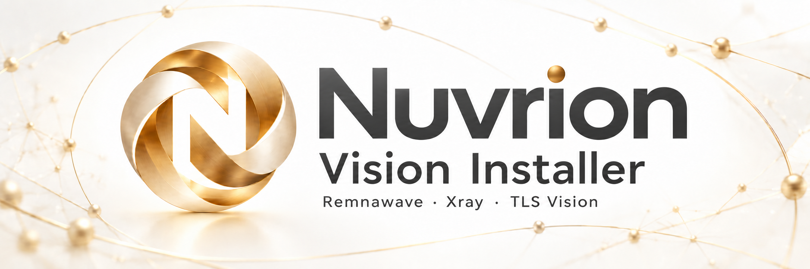
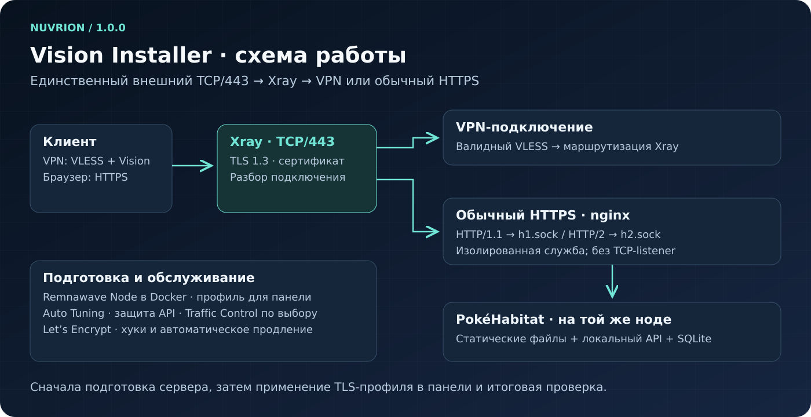
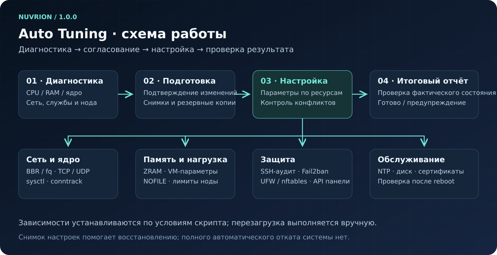
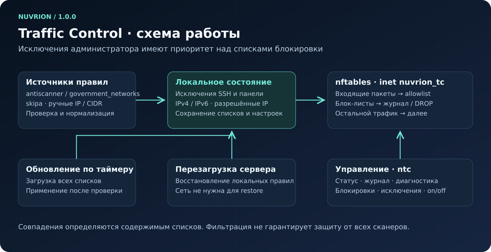

<div align="center">



# Nuvrion Vision Installer

### VLESS TLS Vision + Unix-Socket Decoy для Remnawave


[](https://github.com/nuvrion-kvn/Nuvrion-Vision-Installer/actions/workflows/validate.yml)
[](LICENSE)


**RemnaNode · Xray · TLS 1.3 · XTLS Vision · nginx · Unix sockets · Auto Tuning · Traffic Control**

</div>

## Первый выпуск Nuvrion

Версия проекта и поставляемых скриптов — **1.0.0**. Новые имена файлов, переменных окружения и служб приведены в инструкциях ниже. Установка под новым именем не переносит настройки ранее установленного проекта автоматически. Для существующего сервера сначала проверьте службы, пути и правила firewall; новые команды рассчитаны на установку Nuvrion.

## Назначение

**Nuvrion Vision Installer 1.0.0** разворачивает Remnawave-ноду на отдельном Linux-сервере: RemnaNode в Docker, Xray с VLESS TCP/RAW, TLS 1.3 и XTLS Vision, сертификат и автономный HTTPS-сайт PokéHabitat.

Внешний TCP/443 обслуживает Xray. Валидные VPN-подключения проходят через VLESS, обычные HTTPS-запросы передаются nginx по Unix-сокетам HTTP/1.1 и HTTP/2. Игровой интерфейс, изображения, API и база SQLite размещаются на той же ноде.

Установщик проводит диагностику и подготовку ОС, применяет встроенный Auto Tuning, ограничивает API адресами панели и предлагает Traffic Control. Показывает состояние компонентов и профиль, который нужно применить в панели Remnawave. Подтверждения изменений и проверки после установки сохранены.

## Что устанавливается

- последняя Remnawave Node в Docker (`remnawave/node:latest` на момент установки); после загрузки образ закрепляется по digest;
- Xray с VLESS, TLS 1.3 и режимом Vision;
- сертификат Let's Encrypt, автоматическое продление и проверка `certbot renew --dry-run`;
- nginx с HTTP/1.1 и HTTP/2 только через `h1.sock` и `h2.sock`;
- Nuvrion Auto Tuning `1.0.0`;
- Nuvrion Traffic Control `1.0.0` — по отдельному согласию;
- UFW, Fail2ban, ZRAM, BBR/fq и системные защитные настройки;
- защита от входящих IPv4/IPv6 echo-запросов и IPv4 timestamp-проб с автозапуском до сети;
- готовый профиль ноды и параметры Host для Remnawave.

<h3>Схема работы</h3>



Внешний TCP/443 принадлежит Xray. nginx обслуживает только Unix-сокеты. API RemnaNode слушает заданный порт, но UFW разрешает доступ только исходящим IP панели. Traffic Control применяется последним отдельным слоем nftables.

## Алгоритм установки

| Этап | Действие |
|---:|---|
| 00 | Проверка `root`, systemd, ОС, архитектуры, APT и обязательных компонентов |
| 00 | Одно согласие на все действия APT текущего запуска; показ и повторная проверка каждого плана; остановка при удалениях |
| 01 | Запрос домена, API-порта, IP панели, email и секретного ключа |
| 02 | Проверка DNS, свободного места, портов, SSH и отсутствия конфликтующей установки |
| 03 | План и установка Docker; атомарное сохранение проекта с менеджером и отметкой незавершённой подготовки; план nginx и установка служб |
| 04 | Загрузка RemnaNode из `latest`, закрепление загруженного образа по digest и запуск nginx через два Unix-сокета |
| 05 | Продвинутая настройка сервера и включение UFW до запуска API |
| 06 | Усиление SSH с сохранением действующего способа входа и `AllowTcpForwarding`; включение защиты от входящих ping- и timestamp-проб |
| 07 | Повторная строгая проверка UFW для обеих адресных семейств, запуск RemnaNode и ожидание TCP-listener API (mTLS проверяется при связи с панелью) |
| 08 | Выпуск сертификата, проверка домена, dry-run продления и закрытие TCP/80 |
| 09 | Предложение установить Traffic Control, применение списков и самодиагностика |
| Итог | Проверка Xray, TLS, Unix-сокетов, контейнера, firewall, служб и вывод профиля |

Traffic Control устанавливается последним — после загрузок и первичного ACME-цикла. IP панели берутся из уже введённых настроек ноды, а IP администратора и порт SSH — из текущего SSH-подключения, поэтому повторно вводить их не требуется. Если установка запущена из локальной консоли, недостающие значения запрашиваются вручную. Итоговая проверка выполняется уже со всеми компонентами и завершается отдельным русскоязычным отчётом «компонент — статус» с выравниванием по экранным символам. Все запросы подтверждения Д/Н выделяются жёлтым жирным цветом.

## Требования

- чистый сервер Ubuntu 22.04/24.04 или Debian 12/13;
- архитектура `x86_64` или `arm64`, права `root` и systemd;
- прямой публичный адрес и свободные TCP-порты `80`, `443` и порт API;
- домен с A/AAAA-записями только на адреса этого сервера, без CDN-проксирования;
- Remnawave Panel 3.3.0+;
- созданная нода с API-портом `2222` и полным `SECRET_KEY`;
- исходящий IP панели и email для Let's Encrypt;
- аварийная консоль хостера на время первой установки.

## Быстрая установка

Запустите от `root`:

```bash
bash <(curl -fsSL https://raw.githubusercontent.com/nuvrion-kvn/Nuvrion-Vision-Installer/main/nuvrion-vision-install.sh)
```

## Установка с проверкой SHA-256

```bash
curl -fsSLO https://raw.githubusercontent.com/nuvrion-kvn/Nuvrion-Vision-Installer/main/nuvrion-vision-install.sh
curl -fsSLO https://raw.githubusercontent.com/nuvrion-kvn/Nuvrion-Vision-Installer/main/SHA256SUMS
sha256sum -c SHA256SUMS && bash ./nuvrion-vision-install.sh
```

Одно разрешение в начале действует на обновление индексов APT, системных пакетов и установку необходимых компонентов, включая Docker и nginx, только в рамках текущего запуска. Каждый непустой план показывается с точными версиями и повторно проверяется перед применением. Обновление выполняется через `apt-get --with-new-pkgs upgrade`: новые зависимости, включая доступные пакеты ядра, разрешены, удаления запрещены (`--no-remove`). Переход на другой выпуск ОС и форсирование phased updates Ubuntu не выполняются. При удержанном или отсутствующем метапакете ядра новое ядро не гарантируется.

После успешного обновления предлагается `autoremove` с отдельным подтверждением списка ненужных зависимостей, затем `autoclean` для устаревших скачанных архивов. Конфигурационные файлы не очищаются (`--purge` не используется). Все установленные ядра, загрузчик и ключевые сетевые/системные компоненты защищены от автоматического удаления; старые ядра можно разбирать вручную после проверки загрузки нового. Если план очистки небезопасен, не рассчитывается или изменился перед применением, удаление пропускается. Первое обновление с ядром и сборкой initramfs всё равно может занимать заметное время.

`fail2ban` и `unattended-upgrades` устанавливаются вместе с обязательными пакетами, чтобы Auto Tuning не повторял обновление индекса APT. Дополнительный `apt update` выполняется только после добавления официального репозитория Docker — без него APT не увидит пакеты Docker. Блок ZRAM обновлён: блок ZRAM встроенного Auto Tuning: ограничено ожидание APT и служб, добавлены журналы и проверяемый перенос запуска на новое ядро. Если пакет ZRAM отсутствует в индексе, тюнинг может один раз обновить индекс APT. При отсутствии модуля в текущем ядре тюнинг выбирает самое новое уже установленное ядро того же типа с загрузочным образом. На Ubuntu при необходимости устанавливает `linux-modules-extra` для выбранного нового ядра, повторно проверяет файл модуля и включает отложенный запуск. Текущие ядра с рабочим ZRAM и чужие менеджеры сохраняются. Переход на другой тип ядра и установка нового ядра ради ZRAM не выполняются. Недоступный пакет, сбой APT или отсутствие модуля после установки остаются предупреждением; неподтверждённый запуск не объявляется готовым. Отчёт показывает «Ожидает перезагрузки» только при наличии загрузочного образа, модуля и включённой службы. Перезагрузка остаётся ручной. Исправлена предварительная проверка APT: вывод `apt-cache policy` читается полностью, без ложного отказа из-за закрытого pipe. Отрицательный или ошибочный результат этой проверки больше не запрещает ограниченную по времени установку `apt-get`; ошибки и вывод APT сохраняются в журнале. Запрет удаления пакетов, таймауты и запрет автоматического перезапуска служб сохранены.

Версия установщика — `1.0.0`. ZRAM автоматически подготавливается для самого нового установленного загрузочного ядра того же типа, когда в работающем ядре нет модуля. PokéHabitat полностью размещается на ноде. В проверенном встроенном архиве находятся React-интерфейс, каталог 95 покемонов, все изображения, игровой сервер и миграции SQLite. Сохраняются RU/EN, эволюции, анимации атак, выдача карт, личный кабинет, PvP, тренировки, друзья, задания и рейтинг. Новые выпуски публикуются GitHub Actions только после успешных проверок.

При работе сайт не обращается к ChatGPT Sites, Cloudflare, PokéAPI, внешним базам, CDN или шрифтам. Nginx отдаёт файлы из `/var/www/decoy`, а `/api/game/` передаёт локальному игровому серверу по Unix-сокету. Обоим службам разрешён только `AF_UNIX`, исходящий IP-трафик запрещён. На ноде не устанавливаются npm-зависимости: сервер и интерфейс уже собраны.

Аккаунты, карты, бои и прогресс каждой ноды хранятся в её `/var/lib/nuvrion-pokehabitat/game.sqlite`. Разные ноды — отдельные игровые сообщества: аккаунты и PvP между ними не синхронизируются. Учётные записи прежнего облачного сайта автоматически не переносятся. Пароли защищены bcrypt, сессии и коды восстановления хешируются; локальный секрет в `/etc/nuvrion-pokehabitat.env` создаётся один раз с правами `0600`. Origin настроенного HTTPS-домена проверяется без подмены; cookie сохраняют Secure, HttpOnly и SameSite. SQLite-транзакции и версии записей защищают от повторной выдачи наград и конкурентного списания монет.

Если игровой сервис остановлен, атлас и изображения остаются доступны; API возвращает JSON/503. Установщик считает неработающий локальный API ошибкой. Во время установки по-прежнему нужен интернет для APT/Docker, закреплённого Node.js 24.19.0 и сертификата Let's Encrypt. Node.js загружается с nodejs.org с проверкой встроенного официального SHA-256 для x64/arm64; после установки сайт работает без внешнего игрового сервера. Автопродление публичного TLS-сертификата требует доступа к ACME.

Это установщик новой выделенной ноды. Уже установленные ноды автоматически не обновляются; повторная новая установка поверх имеющейся базы запрещена. Для резервной копии игры сохраняйте **базу вместе с локальным секретом**. Копировать работающую SQLite обычным `cp` нельзя: используйте SQLite backup API или остановите `nuvrion-pokehabitat.service` на время копирования базы и WAL/SHM. Секрет нельзя публиковать. Исходники, сборка, лицензии и точный frontend snapshot находятся в `site/`.

`main` изменяется со временем. Для воспроизводимой установки используйте файлы [конкретного выпуска](https://github.com/nuvrion-kvn/Nuvrion-Vision-Installer/releases) или URL с полным SHA коммита. Сумма, скачанная рядом со скриптом, обнаруживает повреждение/рассинхронизацию, но не является независимой подписью. Короткий запуск через process substitution не проверяет SHA-256 самого установщика.

## Версия, коды завершения и продолжение

```bash
bash ./nuvrion-vision-install.sh --version
bash /opt/remnanode/installer.sh --resume
bash /opt/remnanode/installer.sh --check
```

Коды `--install`, `--resume`, `--check`: `0` — локальные проверки пройдены; `1` — ошибка; `2` — компоненты установлены, но ещё ожидается профиль TLS/443 из панели. `130` — прерывание, `143` — сигнал TERM. Код `2` не означает необходимость переустановки. Лишние аргументы отклоняются. Приглашения подтверждения видны в SSH-терминале даже при перенаправлении stdout в файл.

Сначала проект целиком записывается во временный каталог рядом с `/opt/remnanode`, синхронизируется с диском и атомарно переименовывается. Вместе с настройками сохраняются менеджер, исходные файлы bootstrap и отметка `.bootstrap-pending`. Установка nginx и служб выполняется после этого. При обычном сбое незавершённый временный каталог удаляется; после SIGKILL/отключения питания может остаться `remnanode.staging.*`, который не мешает новому запуску, но содержит закрытые настройки.

Если `/opt/remnanode` уже создан этой ревизией, `--resume` восстанавливает незавершённую подготовку. После успешных проверок записывается `.installation-complete`: дальнейший `--resume` выполняет только проверку и вывод профиля, без повторного тюнинга и ACME. Не удаляйте каталог ноды, сертификаты и firewall вслепую. Повреждённые установки требуют ручного разбора. `--resume` не обновляет предыдущие версии/ревизии: используйте сохранённый `/opt/remnanode/installer.sh`. Публикация на GitHub сама по себе не меняет уже работающие серверы.

## Изменения вне каталога ноды и ограничения отката

Помимо `/opt/remnanode`, установка затрагивает:

- пакеты APT, Docker и nginx; `/etc/apt/keyrings/nuvrion-docker.asc`, `/etc/apt/sources.list.d/nuvrion-docker.sources`;
- `/var/www/decoy`, собственные `nuvrion-decoy.service`, `nuvrion-pokehabitat.service` и `nuvrion-acme-cleanup.service`; штатная `nginx.service` останавливается и маскируется;
- `/etc/letsencrypt` и собственные хуки `90-nuvrion-vision` в каталогах pre/post/deploy; `certbot.timer`;
- drop-in SSH `/etc/ssh/sshd_config.d/00-nuvrion-vision.conf`, собственные sysctl-файлы и резервные копии;
- настройки и службы Auto Tuning, UFW, Fail2ban, `/usr/local/sbin/nuvrion-two-way-ping.sh`, `nuvrion-two-way-ping.service`, таблицу `inet nuvrion_privacy`, а при согласии — файлы и таблицу nftables Traffic Control;
- блокировку `/run/nuvrion-vision.lock`, временные каталоги подготовки и журналы.

Полного автоматического отката APT, Docker, тюнинга и firewall нет. Обработчик завершения удаляет свои временные файлы и пытается закрыть собственный временный доступ ACME; состояние сервера после ошибки нужно проверить. Для удаления нужен отдельный план с учётом реально установленных компонентов — не используйте `rm -rf /opt/remnanode` как деинсталляцию.

Pre/post-хуки Certbot глобальны для хоста. После удаления компонента они не вызывают отсутствующий helper. При частично повреждённой установленной ноде выводится ошибка; если helper сохранился, post-hook закрывает только собственные временные правила даже без маркера. Ошибка хука сама по себе не доказывает, что Certbot отменил продление: проверяйте результат и TCP/80 отдельно.

Docker-ключ загружается с официального HTTPS-адреса и ограничен `Signed-By`; фиксированный отпечаток не задан. Образ закрепляется после первого pull, а не сверяется с заранее доверенным digest. Встроенные Auto Tuning и Traffic Control закреплены SHA-256 на этапе сборки. Встроенные копии выпускаются как компоненты Nuvrion 1.0.0; их хеши проверяются при сборке установщика.

> [!CAUTION]
> Установка рассчитана на отдельный чистый сервер. Не закрывайте текущую SSH-сессию до проверки повторного входа. Секретный ключ ноды никогда не публикуйте в Issues или диагностических отчётах.

## Продвинутая настройка — Auto Tuning

Встроенный Nuvrion Auto Tuning рассчитывает настройки по CPU и RAM и применяет их до первого запуска API:

<h3>Схема работы</h3>

<p align="center">
  <a href="assets/auto-scheme.svg">
    
  </a>
</p>

- включает BBR и целевой `fq`, настраивает TCP/UDP-буферы, backlog и SYN backlog;
- рассчитывает `conntrack`, диапазон временных портов и безопасные сетевые параметры;
- создаёт и дважды проверяет ZRAM, добавляет безопасные VM-настройки;
- включает RPS для распределения обработки пакетов по доступным ядрам;
- подготавливает лимиты нагрузки и `NOFILE` для RemnaNode;
- устанавливает и проверяет Fail2ban;
- включает UFW с запретом входящих соединений по умолчанию;
- оставляет TCP/443 публичным, а API разрешает только IP панели;
- проверяет NTP, TRIM, место, inode, Docker socket и чувствительные порты;
- сохраняет снимок состояния и планирует самопроверку после перезагрузки.

Настройка не отключает и не выбирает семейство IP. Сертификатом управляет сам Vision Installer на этапе 08, после чего итоговая проверка подтверждает его состояние.

Отчёты:

```text
/opt/remnanode/tuning-report.log
/var/lib/nuvrion-tuning/post-reboot-last.txt
```

## Защита от Two-Way Ping

На этапе усиления сервера устанавливается отдельный ранний nftables-слой `inet nuvrion_privacy`. Он блокирует только входящие IPv4/IPv6 echo-request и IPv4 timestamp-request. Исходящий ping, ответы на исходящие запросы, ICMP-ошибки, Path MTU Discovery и служебные ICMPv6-сообщения не блокируются.

```bash
systemctl status nuvrion-two-way-ping.service
/usr/local/sbin/nuvrion-two-way-ping.sh status
```

Служба восстанавливает правила при загрузке до `network-pre.target`. Остановить защиту до следующего запуска службы можно командой `systemctl stop nuvrion-two-way-ping.service`, вернуть — `systemctl start nuvrion-two-way-ping.service`.

## Traffic Control

Nuvrion Traffic Control — утилита сетевой защиты Linux-сервера от автоматического сканирования портов и нежелательных подключений. Блокирует известные IP-адреса и подсети сканеров на уровне `nftables`, включая сети российских государственных структур, Роскомнадзора и связанных с ними организаций при использовании соответствующих списков блокировки. Поддерживает IPv4/IPv6, три внешних списка, логирование и статистику срабатываний. Устанавливается только после согласия пользователя.

<h3>Схема работы</h3>

<p align="center">
  <a href="assets/traffic-scheme.svg">
    
  </a>
</p>

Компонент:

- загружает три внешних списка: `antiscanner`, `government_networks`, `skipa`;
- проверяет размер, формат и синтаксис полученных IP/CIDR;
- объединяет записи в интервальные наборы nftables;
- автоматически определяет IP текущего администратора и SSH-порт;
- предлагает подтвердить исходящие IP панели;
- добавляет администратора и панель в исключения;
- не применяет списки к SSH-порту, чтобы снизить риск потери доступа;
- ведёт ограниченный журнал блокировок и показывает топ-10 IP;
- восстанавливает правила после загрузки;
- ежедневно обновляет списки и сразу применяет проверенную версию;
- имеет самодиагностику и автоматическое восстановление компонентов;
- не изменяет посторонние таблицы nftables и правила UFW.

### Короткие команды

| Команда | Назначение |
|---|---|
| `ntc` | открыть главное меню |
| `ntc s` | показать состояние и размеры списков |
| `ntc t` | показать топ-10 заблокированных IP |
| `ntc c` | выполнить самодиагностику |
| `ntc u` | обновить три внешних списка |
| `ntc l` | показать последние журналы |
| `ntc r` | показать правила nftables |
| `ntc fix` | исправить обнаруженные проблемы |
| `ntc on` | включить фильтрацию и автозапуск |
| `ntc off` | выключить фильтрацию без удаления программы |

Полная справка: `nuvrion-traffic-control --help`.

## Профиль ноды

После установки профиль сохраняется в `/opt/remnanode/vision-config-profile.json`. Создайте в Remnawave новый профиль конфигурации, вставьте JSON целиком и назначьте профиль нужной ноде. Пользователей в `clients` вручную добавлять не нужно.

### Ключевые параметры профиля

| Параметр | Значение | Назначение |
|---|---|---|
| Inbound tag | `Vision-TLS` | имя inbound для Host |
| Protocol | `vless` | протокол подключения пользователей |
| Port | `443` | внешний TLS endpoint |
| Network | `tcp` | транспорт TCP/RAW |
| Security | `tls` | TLS завершает Xray |
| TLS minVersion | `1.3` | TLS 1.2 отклоняется |
| Flow | `xtls-rprx-vision` | режим Vision |
| `tcpFastOpen` | `true` | включает TCP Fast Open на входящем сокете Xray |
| `tcpcongestion` | `bbr` | закрепляет BBR для TCP-соединений inbound |
| TCP keepalive | idle `60`, interval `30` | обнаруживает потерянные долгоживущие соединения |
| ALPN | `h2`, `http/1.1` | выбор соответствующего Unix fallback |
| h2 fallback | `/run/xray-fallback/h2.sock` | HTTP/2-заглушка |
| h1 fallback | `/run/xray-fallback/h1.sock` | HTTP/1.1-заглушка |
| `rejectUnknownSni` | `false` | TLS без SNI или с неизвестным SNI получает сертификат сайта |
| DNS | AdGuard DoH, Comss DoH | шифрованное разрешение имён |
| `clients` | `[]` | клиентов динамически добавляет Remnawave |

При подключении без SNI или с неизвестным SNI Xray отдаёт существующий сертификат домена, а обычный HTTPS-запрос попадает на сайт через fallback. Сертификат остаётся действительным для домена ноды: проверка имени при обращении по IP или чужому домену может завершиться ошибкой. Минимальная версия TLS остаётся 1.3. Для уже установленной ноды измените `rejectUnknownSni` на `false` в назначенном ей профиле Remnawave; обновление установщика само по себе этот профиль не меняет.

### Шаблон профиля для копирования

Замените два вхождения `<ДОМЕН_НОДЫ>` своим доменом:

```json
{
  "log": {"access": "none", "dnsLog": false, "loglevel": "warning"},
  "dns": {
    "servers": [
      {"address": "https+local://dns.adguard-dns.com/dns-query", "timeoutMs": 3000},
      {"address": "https+local://dns.comss.one/dns-query", "timeoutMs": 3000}
    ],
    "disableCache": false,
    "disableFallback": false,
    "enableParallelQuery": false
  },
  "inbounds": [
    {
      "tag": "Vision-TLS",
      "port": 443,
      "protocol": "vless",
      "settings": {
        "flow": "xtls-rprx-vision",
        "clients": [],
        "fallbacks": [
          {"alpn": "h2", "dest": "/run/xray-fallback/h2.sock", "xver": 0},
          {"dest": "/run/xray-fallback/h1.sock", "xver": 0}
        ],
        "decryption": "none"
      },
      "sniffing": {
        "enabled": true,
        "routeOnly": true,
        "destOverride": ["http", "tls", "quic"]
      },
      "streamSettings": {
        "network": "tcp",
        "security": "tls",
        "sockopt": {
          "tcpFastOpen": true,
          "tcpcongestion": "bbr",
          "tcpKeepAliveIdle": 60,
          "tcpKeepAliveInterval": 30
        },
        "tlsSettings": {
          "alpn": ["h2", "http/1.1"],
          "minVersion": "1.3",
          "certificates": [
            {
              "keyFile": "/etc/letsencrypt/live/<ДОМЕН_НОДЫ>/privkey.pem",
              "certificateFile": "/etc/letsencrypt/live/<ДОМЕН_НОДЫ>/fullchain.pem"
            }
          ],
          "rejectUnknownSni": false
        }
      }
    }
  ],
  "outbounds": [
    {"tag": "DIRECT", "protocol": "freedom"},
    {"tag": "BLOCK", "protocol": "blackhole"}
  ],
  "routing": {
    "domainStrategy": "IPIfNonMatch",
    "rules": [
      {"type": "field", "port": "443", "network": "udp", "inboundTag": ["Vision-TLS"], "outboundTag": "BLOCK"},
      {"type": "field", "port": "25", "network": "tcp", "outboundTag": "BLOCK"},
      {"type": "field", "protocol": ["bittorrent"], "outboundTag": "BLOCK"},
      {"type": "field", "ip": ["geoip:private"], "outboundTag": "BLOCK"},
      {"type": "field", "domain": ["geosite:private"], "outboundTag": "BLOCK"},
      {
        "type": "field",
        "domain": [
          "geosite:category-ads-all",
          "domain:analytics.google.com",
          "domain:adjust.net.in",
          "domain:amplitude.com",
          "domain:metrika.yandex.ru",
          "domain:mytracker.ru"
        ],
        "outboundTag": "BLOCK"
      }
    ]
  }
}
```

## Настройки Host в Remnawave

```text
Адрес:          ваш-домен.example
Порт:           443
SNI:            ваш-домен.example
Security Layer: TLS (Transport Layer Security)
Отпечаток:      firefox
ALPN:           h2,http/1.1
Inbound:        Vision-TLS
```

Адрес и SNI должны совпадать с доменом сертификата. Готовая памятка сохраняется в `/opt/remnanode/host-settings.txt`.

## Проверка и обслуживание

```bash
bash /opt/remnanode/installer.sh --check
```

Проверяются API, Xray, TLS 1.3, отклонение TLS 1.2, сертификат, HTTP/1.1 и HTTP/2, Unix-сокеты, UFW, Traffic Control, AppArmor, seccomp, `no-new-privileges`, BBR/fq/TFO, Fail2ban и автозапуск служб.

| Путь | Назначение |
|---|---|
| `/opt/remnanode/installer.sh` | обслуживание и повторная проверка |
| `/opt/remnanode/vision-config-profile.json` | профиль ноды |
| `/opt/remnanode/host-settings.txt` | настройки Host |
| `/opt/remnanode/fallback-sockets/` | Unix-сокеты h1/h2 |
| `/opt/remnanode/tuning-report.log` | отчёт продвинутой настройки |
| `/var/www/decoy/` | автономный интерфейс и изображения PokéHabitat |
| `/usr/local/lib/nuvrion-pokehabitat/` | собранный игровой API и SQL-миграции |
| `/var/lib/nuvrion-pokehabitat/game.sqlite` | аккаунты, карты, бои и прогресс этой ноды |
| `/etc/nuvrion-pokehabitat.env` | локальный секрет авторизации, root:root 0600 |
| `/run/nuvrion-pokehabitat/game.sock` | Unix-сокет локального игрового сервера |
| `/opt/nuvrion-node/` | отдельный закреплённый Node.js runtime |

## Сетевые порты

| Порт | Доступ |
|---|---|
| SSH-порт | административный доступ; сохраняется установщиком |
| `443/tcp` | публичный VLESS TLS Vision и автономный HTTPS-сайт |
| `2222/tcp` | только исходящие IP панели Remnawave |
| `80/tcp` | временно во время Certbot HTTP-01 |
| `8080/8081/18080/18081` | закрыты и не используются |

## Автор и лицензия

**Nuvrion**  
GitHub: **[nuvrion-kvn](https://github.com/nuvrion-kvn)**  
Email: **[himik0011113@gmail.com](mailto:himik0011113@gmail.com)**

Оригинальный код Nuvrion распространяется по лицензии [MIT](LICENSE). Источники внешних списков и общие пакеты перечислены в [THIRD_PARTY_NOTICES.md](THIRD_PARTY_NOTICES.md).
